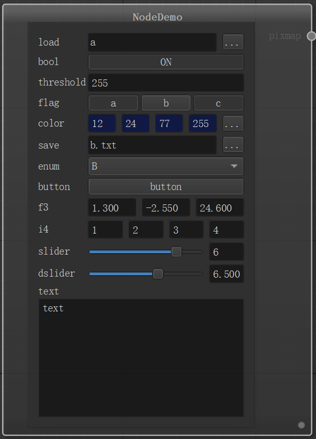

# 1. PLUGIN_DEMO

> 这是一个插件的demo，也是测试用例。

<!-- 目录 -->
- [1. PLUGIN_DEMO](#1-plugin_demo)
  - [1.1. Overview](#11-overview)
  - [1.2. Build & Install](#12-build--install)
    - [1.2.1. Dependencies](#121-dependencies)
    - [1.2.2. Build](#122-build)
    - [1.2.3. Install](#123-install)
  - [1.3. Origin & References](#13-origin--references)
  - [1.4. Show](#14-show)

## 1.1. Overview

插件的demo，罗列了各种控件

## 1.2. Build & Install
### 1.2.1. Dependencies

Qt 5.15.2

### 1.2.2. Build

不要出现中文路径！

```shell
git clone https://github.com/QianMoth/PluginDemo.git
cd PluginDemo
mkdir build

# Release
cmake -S . -Bbuild -DCMAKE_BUILD_TYPE=Release
cmake --build build --config Release

# Debug
cmake -S . -Bbuild -DCMAKE_BUILD_TYPE=Debug
cmake --build build --config Debug
```
### 1.2.3. Install

build结束你可以在./build/bin/文件夹下看到plugindemo.dll和plugindemod.dll。

你可以直接复制粘贴到你的插件目录下,也可以通过修改copyfile.sh来安装到指定目录。

如果你是windows用户，在执行shell脚本需要考虑是否安装了能执行shell的工具，如git。

```shell
#!/bin/bash

cur_path=$(readlink -f "$(dirname "$0")")
# 打印当前文件路径
echo $cur_path

# 找到结尾有d的dll文件安装到Debug目录
find $cur_path/build/bin/  -name "*d.dll" -exec cp {} $cur_path/../nodeeditor-p/build/bin/Debug/nodes/ \;
# 找到结尾没有d的dll文件安装到Debug目录
find $cur_path/build/bin/ ! -name "*d.dll" -a -name "*.dll" -exec cp {} $cur_path/../nodeeditor-p/build/bin/Release/nodes/ \;
```

## 1.3. Origin & References

此项目在nodeeditor基础上，添加了spkgen的功能。

- [nodeeditor](https://github.com/paceholder/nodeeditor.git)
- [spkgen](https://github.com/fredakilla/spkgen.git)


## 1.4. Show

node预览

